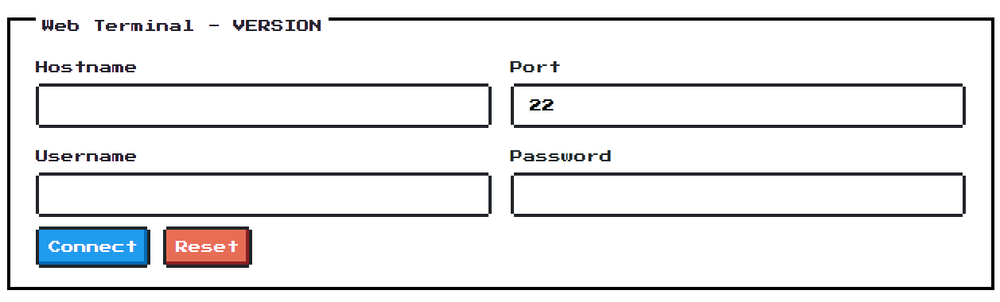
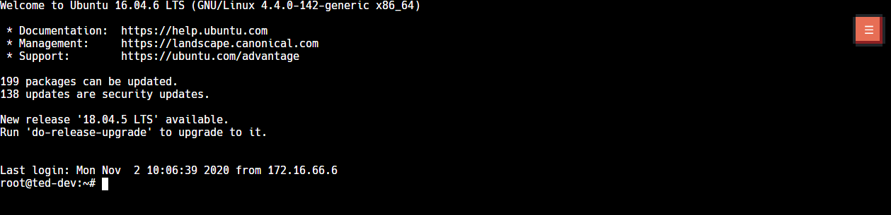
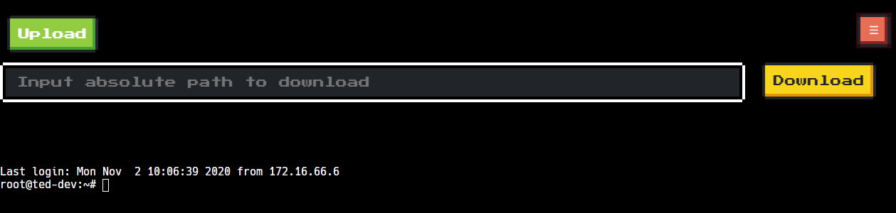

# term1nal
A simple web terminal written in Python and JavaScript, which contains these features:

* Web terminal support by Xterm.js
* Copy on selecting text
* Upload/Download directly to server
* Preventing shell shortcut(Ctrl+W) to close browser tab accidently

# Third-party Libraries

* [Tornado](https://github.com/tornadoweb/tornado)
* [Paramiko](https://github.com/paramiko/paramiko)
* [Xterm.js](https://github.com/xtermjs/xterm.js/)
* [NES.css](https://github.com/nostalgic-css/NES.css/)

# Screenshots

