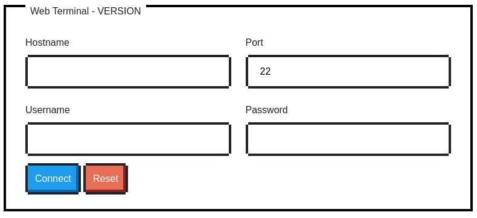
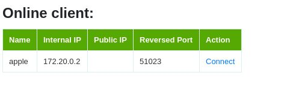
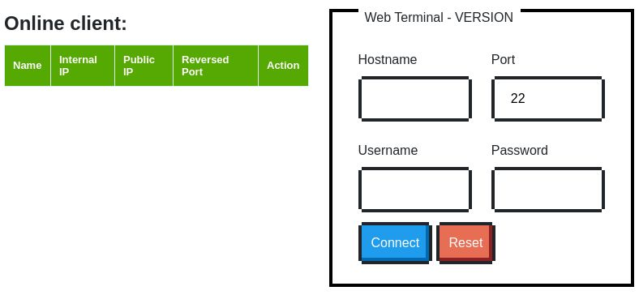

# Gru 
Gru: a simple web terminal written in Python and JavaScript, which contains these features:

* Web terminal support by Xterm.js
* Copy on selecting text
* Upload/Download directly to server
* Preventing shell shortcut(Ctrl+W) to close browser tab accidently
* Reversed SSH tunnel management

Minion: a ssh client to establish reversed SSH tunnel to Gru

# Environment
## GRU
Name | Description | Default
 --- | --- | --- 
SSH_USERS | SSH users to be added(e.g.: SSH_USERS=www:48:48,admin:1000:1000:/bin/bash)| 
GRU_MODE | Gru's mode: term, gru or all | term
GRU_HOST | Gru's listening host | 0.0.0.0
GRU_PORT | Gru's listening port | 8000
GRU_SSL_PORT | Gru's SSH port | 4433
REDIS_HOST | Redis host | localhost
REDIS_PORT | Redis port | 6379
REDIS_DB | Redis database | 0
GRU_CERT_FILE | Certificate file | ./ssl.crt
GRU_KEY_FILE | Key file | ./ssl.key

## Minion
Name | Description | Default
--- | --- | --- 
GRU_HOST | Gru's SSH Host | localhost
GRU_SSH_PORT | Gru's SSH port | envDefault:"22"`
GRU_USERNAME | Gru's SSH username | gru
GRU_PASSWORD | Gru's SSH password | P@ssw0rd
GRU_API_ENDPOINT | Gru's API endpoint | http://localhost:8000
MINION_HOST | Minion's SSH host | localhost
MINION_SSH_PORT | Minion's local ssh port | 22
LOG_LEVEL | Minion's logging level | debug
MINION_ID | Identification of Minion |
MINION_PUBLIC_IP | Minion's public IP if any |
## Misc
* Go 1.14
* Python 3.7

# Third-party Libraries

* [Tornado](https://github.com/tornadoweb/tornado)
* [Paramiko](https://github.com/paramiko/paramiko)
* [Xterm.js](https://github.com/xtermjs/xterm.js/)
* [NES.css](https://github.com/nostalgic-css/NES.css/)

# Screenshots
Web terminal mode

Gru mode

All mode

# Issues
* None(currently) 

